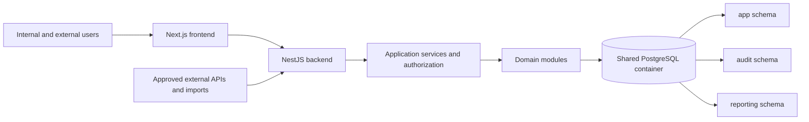

# Architecture

## System shape

The current platform baseline uses three deployable/runtime components only:

1. Next.js frontend
2. NestJS backend
3. PostgreSQL

The application begins as a modular backend with clear domain boundaries. No Redis, external queue, object-store container, mail container, or separate worker deployment is part of the current baseline.



## Repository layout

`FND-01` establishes this layout:

```text
apps/
  frontend/            Next.js UI
  backend/             NestJS HTTP/API and in-process application services
packages/
  domain/              Framework-light domain rules and types
  db/                  Prisma schema, migrations, repositories, seeds
  auth/                Capabilities, scopes, and policy evaluation
  config/              Typed tenant and runtime configuration
tests/
  e2e/                 Playwright journeys
  fixtures/            Cross-module deterministic test data
specs/
  <FEATURE-ID>/        Feature spec, test plan, and completion evidence
```

## Shared PostgreSQL model

- A single local Docker container named `shared-postgres` serves this and other projects.
- The shared persistent volume belongs to the central container, not this repository.
- Each project provisions its own login role, application database, test database, and schemas.
- This project uses `logistics` and `logistics_test`, each with `app`, `audit`, and `reporting` schemas.
- Project commands may create/start and provision the central container but must never stop, reset, or delete it.
- Application migrations operate only within this project's databases/schemas.
- Schema names may expand when a feature demonstrates a clear boundary; database/container proliferation requires an ADR.

## Domain modules

- Identity and tenancy
- Organization and masters
- Clients, contracts, lanes, SLAs, and rate cards
- Vendors, vehicles, drivers, and compliance
- Indents, allocation, and placement
- Trips and milestones
- POD and documents
- Client billing and receivables
- Vendor payables
- Alerts and work queues
- Control-tower reporting
- Imports, exports, integrations, and notifications
- Audit, comments, and approvals

Modules own their writes. Cross-module reads use published query services or reporting projections. Events, idempotency keys, scheduled work, and delivery attempts are persisted in PostgreSQL. Until another infrastructure decision is approved, background work runs within the backend deployment and uses PostgreSQL locking/leases for coordination.

## Data and isolation

- Every tenant-owned row has a non-null tenant key.
- Mixed platform/tenant tables classify nullable tenant keys explicitly and use forced PostgreSQL row-level security. Platform access requires an explicit transaction context; tenant access sees only the matching tenant.
- Natural-key uniqueness is tenant-scoped and includes legal-entity scope when required.
- Repository methods require tenant context; unscoped access is limited to reviewed platform-administration paths.
- Tests create at least two tenants and prove negative access for each tenant-owned aggregate.
- Documents required by current features are stored in PostgreSQL behind a storage abstraction, with metadata, checksum, authorization, and retention controls. A future external object store requires a separate approved ADR.

## Authentication and authorization

Authentication establishes identity. Authorization combines capability plus scope:

```text
allow = role grants capability
        AND resource belongs to current tenant
        AND resource matches at least one assigned scope
        AND no explicit policy block applies
```

Scopes may include legal entity, region, branch, client, location, vendor, and assigned trip. Policy evaluation belongs in reusable backend services and query builders.

## Money, quantities, and time

- Persist currency with ISO code and exact decimal/minor-unit amounts.
- Persist quantities with explicit unit and exact decimal precision.
- Persist instants in UTC and business dates as date values.
- Resolve calendar boundaries in tenant timezone and test timezone behavior.

## Transactions, events, and idempotency

- Financial postings are append-only ledger rows with compensating reversals.
- Imports, external events, receipt posting, payment posting, and notification requests use stable idempotency keys.
- Domain change and event/outbox row commit in one PostgreSQL transaction.
- The backend dispatcher uses PostgreSQL row locking/leases and is safe under retry.

## Reporting

Operational screens read canonical transaction models. Dashboards may use PostgreSQL views/materialized views in the `reporting` schema. Every KPI must reconcile to permission-scoped details and expose freshness.

## Backend and frontend deployment

- Frontend and backend are independently buildable and startable from the monorepo.
- Frontend uses only the documented backend API; it never connects directly to PostgreSQL.
- Backend provides liveness/readiness endpoints and verifies database connectivity/migration state.
- Local deployment starts both processes against central PostgreSQL and Playwright tests through the frontend.
- Local deployment records independently owned frontend/backend PIDs and logs under ignored `.sdlc/runtime/` state and refuses to stop unrelated port owners.

## Security baseline

- Validate all external input and enforce authorization server-side.
- Protect browser state changes against cross-site request forgery where relevant.
- Use secure session/cookie and content-security settings.
- Restrict upload size/type and store current-phase files in PostgreSQL with authorization checks.
- Rate-limit authentication, portals, imports, and external APIs in the backend using PostgreSQL-backed counters only where required; do not add new infrastructure silently.
- Never log secrets, tokens, full bank data, or unnecessary personal data.
