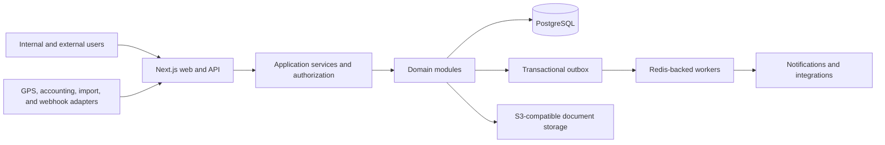

# Architecture

## System shape

The platform is a modular monolith first, with explicit domain boundaries and an event/outbox seam. This keeps local development and transactions simple while allowing high-volume or integration-heavy modules to be extracted later without changing product semantics.



## Planned repository layout

`FND-01` establishes this layout unless the feature spec records a better compatible organization:

```text
apps/
  web/                 Next.js UI and HTTP/API boundary
  worker/              Background jobs and outbox consumers
packages/
  domain/              Framework-light domain rules and types
  db/                  Prisma schema, migrations, repositories, seeds
  auth/                Capabilities, scopes, and policy evaluation
  ui/                  Shared accessible UI components
  config/              Typed tenant and runtime configuration
  observability/       Logs, metrics, traces, audit helpers
tests/
  e2e/                 Playwright journeys
  fixtures/            Cross-module deterministic test data
specs/
  <FEATURE-ID>/        Feature spec, test plan, and completion evidence
```

## Domain modules

- Identity and tenancy
- Organization and masters
- Clients, contracts, lanes, SLAs, and rate cards
- Vendors, vehicles, drivers, and compliance
- Indents, allocation, and placement
- Trips and milestones
- POD and documents
- Client billing and receivables
- Vendor payables
- Alerts and work queues
- Control-tower reporting
- Imports, exports, integrations, and notifications
- Audit, comments, and approvals

Modules own their writes. Cross-module reads use published query services or reporting projections. Cross-module side effects use domain events persisted through a transactional outbox.

## Data and isolation

- All tenant-owned tables have a non-null tenant key and indexes beginning with tenant scope where appropriate.
- Natural-key uniqueness is tenant-scoped, and legal-entity scope is included where numbering rules require it.
- Repository methods require tenant context. Unscoped database access is limited to explicitly reviewed platform administration paths.
- Tests create at least two tenants and prove negative access for every tenant-owned aggregate.
- Files use tenant-separated object keys and authorization-checked signed access.

## Authentication and authorization

Authentication establishes identity. Authorization combines capability plus scope:

```text
allow = role grants capability
        AND resource belongs to current tenant
        AND resource matches at least one assigned scope
        AND no explicit policy block applies
```

Scopes may include legal entity, region, branch, client, location, vendor, and assigned trip. Policy evaluation belongs in reusable server-side services and query builders.

## Money, quantities, and time

- Persist currency with ISO code and exact decimal/minor-unit amounts.
- Persist quantities with explicit unit and exact decimal precision.
- Persist instants in UTC. Persist local-date business concepts separately when they are dates rather than instants.
- Resolve business boundaries in the tenant timezone and test daylight/timezone behavior even though the initial tenant uses `Asia/Kolkata`.

## Transactions and idempotency

- Financial postings are append-only ledger events with compensating reversals.
- Imports, webhook events, receipt posting, payment posting, and notification delivery use stable idempotency keys.
- Business transaction and outbox event commit atomically.
- Workers are safe under at-least-once delivery.

## Reporting

Operational record screens read canonical transaction models. Dashboard aggregates may use database views/materialized projections, but every KPI must reconcile to permission-scoped detail rows and expose data freshness.

## Observability

Use structured logs with request/job correlation IDs, metrics for business and technical health, traces around integrations and background jobs, and immutable audit events for governed changes. Never log secrets, full tokens, unmasked bank data, or unnecessarily sensitive personal data.

## Security baseline

- Validate all external input.
- Apply least privilege and server-side scope checks.
- Protect state-changing browser requests against cross-site request forgery where relevant.
- Use secure cookie/session settings and content-security headers.
- Scan uploads and restrict type/size.
- Rate-limit authentication, public portals, imports, and externally callable APIs.
- Keep dependencies patched and lockfiles committed.

