# Agentic SDLC

## Goal

Turn each feature in `FEATURES.md` into a reviewed, locally deployed, browser-tested, locally committed vertical slice with durable specification and evidence.

## Orchestration model

The primary Codex agent is accountable for the outcome and starts specialized agents defined in `.codex/agents/`. Agents work in ordered phases:

```mermaid
flowchart LR
    S["Select dependency-ready feature"] --> P["Spec analyst + test designer"]
    P --> G["Primary specification gate"]
    G --> I["Implementation worker"]
    I --> C["Unit/integration/type/lint gates"]
    C --> L["Local deploy"]
    L --> E["E2E tester"]
    E --> R["Independent reviewer"]
    R -->|"blocking finding"| I
    R --> V["Final verification"]
    V --> S2["Synchronize status, tests, README, TODO, specs, docs"]
    S2 --> D["Completion evidence + final verification"]
    D --> M["Focused local Git commit"]
```

Specification and test design can run in parallel because they own separate files. Production implementation is single-owner. Review may run in parallel with read-only analysis, but final verification waits for all agents.

## Phase gates

### 1. Intake

- Select one feature whose dependencies are Complete.
- Read the feature section, product-wide rules, cross-feature journeys, and relevant supplied data dictionary.
- Inspect repository state and record pre-existing changes.
- Create a feature branch when the repository's current workflow uses branches. Do not force branch changes over user work.

### 2. Specification team

- `spec_analyst` creates `specs/<ID>/spec.md`.
- `test_designer` creates `specs/<ID>/test-plan.md`.
- Both trace to acceptance criteria and identify open decisions.
- The primary agent reconciles conflicts and marks the spec Approved for implementation.

### 3. Development

- `implementation_worker` owns production files and implements a complete vertical slice.
- Use small checkpoints, but do not create partial commits unless the user requests them.
- Run focused tests after each material behavior change.

### 4. Local deployment

- Create/start and provision the central shared PostgreSQL container with `make postgres-up`.
- Apply database migrations and seed deterministic E2E fixtures.
- Build and start the frontend and backend with `make deploy-local`.
- Verify project database/schema access, backend readiness, and frontend availability before browser tests.
- Do not add or start a project-specific database or other infrastructure container.

### 5. End-to-end test

- `e2e_tester` implements Playwright scenarios from the approved test plan.
- Cover primary success, authorization isolation, validation, and at least one material exception.
- Prefer role-authenticated API fixtures for setup and UI for behavior under test.
- Retain trace/screenshot/video for failure diagnosis; generated artifacts remain uncommitted.

### 6. Independent review

- `reviewer` examines the full diff and executed evidence.
- Findings are ordered by correctness, isolation/security, financial integrity, migrations, idempotency, test gaps, accessibility, maintainability.
- Implementation worker fixes blocking findings; affected checks repeat.

### 7. Status and documentation synchronization

This is the last functional step after review fixes and before completion/commit:

- Update implementation and test status in both the `FEATURES.md` register and feature section.
- Update `README.md` current project status and next dependency-ready feature.
- Update `TODO.md`: remove completed work and record remaining work with feature ID, state, owner/reason, and evidence.
- Update the feature `spec.md`, `test-plan.md`, and `completion.md`.
- Give every planned test ID a final state: `Implemented`, `Passing`, `Failing`, `Blocked`, or justified `N/A`.
- Update executable test files/fixtures and resolve or record all TODO/FIXME, `.skip`, `.only`, quarantine, or stale test-name markers.
- Update affected architecture, API, data model, deployment, runbook, and package documentation.
- Search the repository for stale feature/test status and inconsistent checklist entries.
- Re-run policy and verification after synchronization.

### 8. Completion and commit

- Run `make verify` from the final tree.
- Create `specs/<ID>/completion.md` with commands and results.
- Change implementation status to Complete and test status to Passing only if all acceptance criteria and required tests pass locally.
- Stage only files belonging to the feature.
- Review `git diff --cached` and secret scan output.
- Create a local Conventional Commit; do not push.

## Failure behavior

- A failed gate stops downstream completion and commit.
- Record a real external blocker in the feature spec with evidence and an actionable unblock condition.
- Do not weaken or skip tests to obtain green status.
- If local deployment is unavailable, the feature remains In progress; unit tests alone are insufficient.
- If a flaky test appears, diagnose and remove nondeterminism. Retrying without explanation is not acceptance.
- If synchronization artifacts disagree with code/test evidence, the feature remains In progress and the commit gate is closed.

## Feature selection

Use dependency order from `FEATURES.md`. Within the ready set, prefer foundations that unlock more downstream features. Never mark a dependency Complete solely to start another feature.
