# Rapid Agentic SDLC

## Goal

Finish coherent groups of logistics features quickly while preserving tenant isolation, authorization, financial integrity, migration safety, and honest delivery status. Implementation and test execution are separate phases.

## Default flow

```mermaid
flowchart LR
    B["Select dependency-compatible batch"] --> N["Lightweight acceptance notes"]
    N --> I["Parallel implementation with non-overlapping ownership"]
    I --> T["Author/update automated tests: Not Run"]
    T --> R["One integrated batch review"]
    R --> S["Synchronize trackers and docs once"]
    S --> G["One lightweight commit gate"]
    G --> C["Optional batch commit"]
    C -. "explicit request only" .-> X["Deploy/test once; record pass/fail"]
```

The default agents are implementation workers and one batch reviewer. Add a specification analyst, test designer, or E2E tester only for an explicit request or material unresolved risk. Parallel workers must own different modules/files.

## Implementation batch

1. Choose the largest coherent batch allowed by dependencies and the user's scope.
2. Inspect the working tree and list included feature/TODO IDs.
3. Record compact acceptance notes: outcome, critical rules, dependencies, affected interfaces, and planned automated tests. Reuse existing specs instead of creating ceremony-only documents.
4. Implement migrations, backend, frontend, authorization, audit, affected reporting/events, documentation, and automated tests together.
5. Do not run tests, deploy, run Playwright, or invoke `make check`/`make verify` automatically per feature. Mark changed tests `Implemented / Not Run`.
6. Review the integrated batch once. Resolve clear blocking findings together without automatically testing after each fix.
7. Synchronize `FEATURES.md`, `README.md`, `TODO.md`, affected specs, test-case lists, and documentation once.
8. When a commit is requested, run formatting, type checking, and policy/status checks once for the batch; inspect the cached diff and create one related Conventional Commit.

## Test status

- `Implemented / Not Run` means the production behavior and executable coverage exist, but no current execution result is claimed.
- `Passing`, `Failing`, and `Blocked` require current command evidence from an explicit test phase.
- Historical results may remain documented with their date/build, but they do not convert new or changed coverage to Passing.

## Explicit batch/release test phase

Enter this phase only when the user explicitly asks for testing, regression, deployment verification, or release verification.

1. Run either the requested focused suites or the full regression—not both by default.
2. Deploy once if the selected tests require running services. Use the shared PostgreSQL container and project databases/schemas only.
3. Run each selected suite once. Do not retry automatically.
4. Record pass/fail/block status and concise evidence across the affected trackers.
5. Add failures to `BUGS.md` or `TODO.md` with observed behavior and evidence. Do not auto-fix or rerun unless requested.

## Completion states

- **In progress:** production work is incomplete.
- **Implemented:** requested production behavior and test coverage are present; tests may be Not Run.
- **Verified:** the explicitly selected test scope passed for the recorded build.

A feature can be implementation-complete while tests are Not Run. It must not be labeled Passing or Verified without execution evidence.

## Failure behavior

- A code-review blocker prevents implementation completion until resolved.
- A test failure in an explicit test phase is recorded once and does not trigger an automatic fix/retest loop.
- Never weaken isolation, authorization, financial rules, migrations, or tests to obtain green status.
- Never report an unexecuted test, deployment, or regression as successful.
